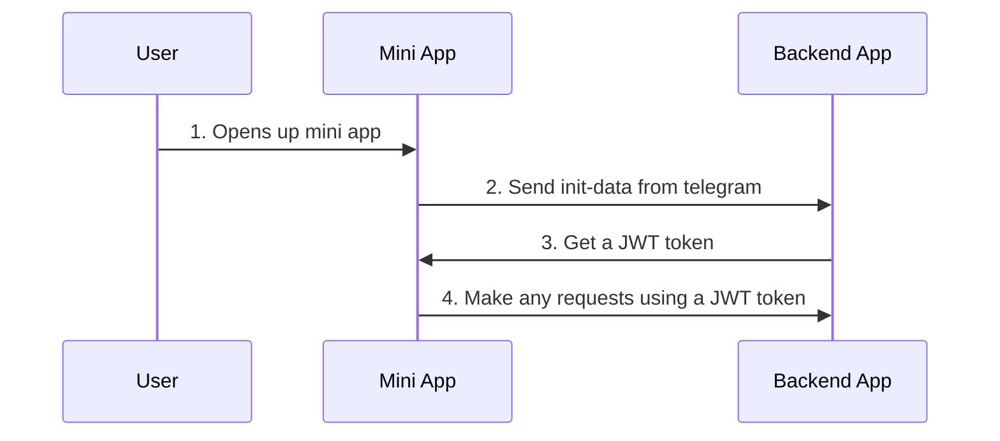

# Backend for TeleHire mini app

[](https://app.renovatebot.com/dashboard)

## Description <!-- omit in toc -->

NestJS REST API boilerplate for typical project

[Full documentation here](https://github.com/brocoders/nestjs-boilerplate/blob/main/docs/readme.md)

## Table of Contents <!-- omit in toc -->

- [Features](#features)
- [Quick start](#quick-start)
- [Authorization](#authorization)
- [Casl implementation](#casl-implementation)
- [Automatic update of dependencies](#automatic-update-of-dependencies)

## Features

- [x] Database ([prisma](https://www.prisma.io/) with PostgresQL).
- [x] Authentication through telegram's init data.
- [x] Swagger.
- [x] Docker.

## Quick start

```bash
git clone --depth 1 https://github.com/brocoders/nestjs-boilerplate.git my-app
cd my-app/
cp env-example .env
docker compose up -d
```

For check status run

```bash
docker compose logs
```

## Authorization

Here's an overview of the authorization flow:



1. The client application obtains initialization data from Telegram(via @twa/dev). This data is sent to the backend for authentication.
2. The backend receives the initialization data from the client application and validates it. This step involves checking the data for correctness, ensuring it hasn't been tampered with, and confirming that it's from a trusted source (Telegram).
```js
validate(
  initDataString,
  this.configService.getOrThrow('telegram.token', { infer: true }),
);

const data = initData.parse(initDataString);
      
if (data.user === undefined) {
  throw new UnauthorizedException();
}
```
> initDate and validate are imported from `@twa.js/init-data-node`

1. If the initialization data is valid, the backend generates a JWT token and updates user information stored in our database. This token contain user information.
2. The client application receives the JWT token from the backend. This token can be used for subsequent authorized requests to the backend API.

Other approach is to use init-data string directly as an authorization token 

The flow simplifies to just sending init data in headers with each request

If such a case please check out example passport strategy `src/auth/strategies/telegram.strategy.ts`

Usage same as any other strategies
```typescript
@Controller()
@UseGuards(AuthGuard('twa'))
export class CatsController {
  @Get()
  async index(@Req() request: Request) {
    request.user // the user object returned from TwaStrategy
  }
}
```

## Casl implementation

To restrict what resources a given user is allowed to access we can apply CASL policy

Examples can be found inside `src/ability`

To integrate TWA authorization replace `AuthGuard('jwt')` with `AuthGuard('twa')` inside `src/auth/guards/casl.guard.ts`


## Automatic update of dependencies

If you want to automatically update dependencies, you can connect [Renovate](https://github.com/marketplace/renovate) for your project.

